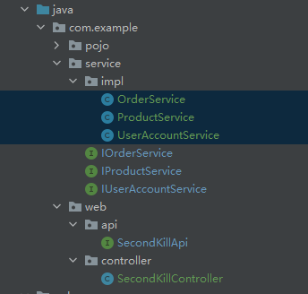

# 秒杀案例

## 需求分析

1. 顾客点击按钮，购买商品
2. 可能有多个同时购买
3. 商品数量固定
4. 库存不足时不能购买

## v1.0 概要设计

1. 粗略的版本：

   - 用户如果余额不足不能购买，如果购买成功需要对应的减少账户金额
   - 库存要相应减少

### 1.1 建模

1. 用户表：用于记录个人信息，该网站的唯一标识
2. 用户账户表： 用于记录一个时刻用户的余额
3. 产品表：用于记录商品的基本信息，秒杀目标
4. 订单表：用于用户购买商品后，记录商品与用户的联系

### 1.2 概要设计

- 将需求翻译成开发人员自己的语言
- 界面原型：axure,ui,前端
- 后台程序接口：后端
- 为什么用接口
  - 接口可以通过 swagger、伪接口语言，将接口转化为其他岗位能看懂的内容
- 前端用户 api：用户需要用的 api,用户在操作时需要用的阿皮

```java
/**
 * <p>前端用户接口，该类主要用于前端请求直接调用的</p>
 */
public interface SecondKillApi {

    // 我们首先把所有的有可能要调用的方法都汇总在这里，后面再根据需要划分为不同的模块

    /**
     * <p>主要用来呈现秒杀某商品的首页，主要用来呈现以下信息：</p>
     * <ul>
     *     <li>商品名称</li>
     *     <li>商品库存</li>
     *     <li>商品单价</li>
     * </ul>
     * @param productId 商品的主键
     * @return 包含以上字段的一条商品记录
     */
    Product findBy(Integer productId);

    /**
     * <p>该方法是用户秒杀入口</p>
     * @param productId 商品的id
     * @param userId 登录用户的id
     */
    void kill(Integer productId, Integer userId);

}

```

- 用户接口：要实现用户功能，所需要实现的 api

```java
/**
 * <p>订单相关操作</p>
 */
public interface OrderApi {
    /**
     * <p>新增一条购买记录</p>
     * @param order 订单信息
     */
    void saveOrder(Order order);
}

/**
 * <p>商品相关操作</p>
 */
public interface ProductApi {
    /**
     * <p>查询商品基本信息</p>
     * @param productId 商品id
     * @return 商品基本信息
     */
    Product findProductById(Integer productId);
    /**
     * <p>更新商品的库存</p>
     * @param product 商品实例
     */
    void updateProduct(Product product);
}

/**
 * <p>用户账户相关操作</p>
 */
public interface UserAccountApi {
    /**
     * <p>查询商品基本信息</p>
     * @param userId 用户账户的id
     * @return 用户账户信息
     */
    UserAccount findUserAccountById(Integer userId);


    /**
     * <p>更新账户的余额，实现扣款</p>
     * @param userAccount 用户账户实例
     */
    void updateUserAccount(UserAccount userAccount);

}
```

### 1.3 详细设计

- 将笼统的用户接口继续细化拆分，最终将所有的方法都大致定义出来，然后将这些方法要做什么，都写好文档
  
- web 层：处理前端用户的请求
  - api 中的接口：用于于前端对接，交付
  - controller：api 的实现类
- service 层：业务逻辑层，用于对模型，特定的领域，表做一些聚合度高的操作

### 1.4 编码

1. 根据接口和实现类的规划，完成 v1.0.0 的需求
2. 在没有特殊的情况下，可以将都往外抛，最后在进行集中分类处理

### 1.5 事务处理

## v2.0 事务分析

## v3.0 事务管理最终版

## v4.0 多线程竞争

## v5.0 悲观锁与乐观锁

## v6.0 重试
