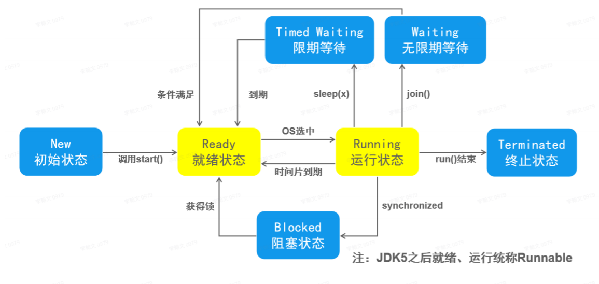

# 多线程

## Thread

1. 继承 Thread 重写 run 方法来将方法放入线程中执行。
2. 程序中可通过实例化子类调用 start 方法开启线程，开启后程序可以继续向下执行无需等待线程执行完成
3. 线程中可以开启线程，如 main（主线程）中开启线程
4. 可以通过匿名内部类新建子类(普通或 lambda)

## Runnable

1. 实现接口可避免 java 单根继承

## 线程与进程

1. Process: 进程，一个程序在运行期间申请的硬件资源，是应用程序独占的，复杂时一个应用程序可以有多个进程
2. Thread: 线程，是一个轻量级的进程，一个进程由多个线程组成，是 CPU 的基本调度单位
3. 创建线程的几种方法
   - 继承 Thread
   - 实现 Runnable
   - new Thread(()->{}) 匿名内部类
4. 进程的状态
   

## 线程安全

### 问题

1. 共享对象一次只有一个线程操作才可以保证准确性
2. 不破坏原子操作才可以保证数据一致

### 线程同步

1. 同步代码块：synchronized(任一引用对象，要保证对象唯一)
2. 同步方法
3. volatile：不使用在缓存在的实例中的值，而是直接使用主存的值。保证对所有对象可见性
4. 原子对象：原子对象只有一步，线程一执行就完毕，不会存在还在修改，尚未赋值的情况

5. 线程死锁：当第⼀个线程拥有 A 对象的锁标记，并等待 B 对象的所标记。同时第⼆个线程拥有 B 对象锁标记，同时等待 A 对 象的锁标记时，产⽣死锁

6. 线程通信

- wait() 暂时休眠，直至被其他线程唤醒
- notify() 、notifyAll() 唤醒线程
- 必须在加锁的同步代码块中

## Lock

1. 和同步代码块类似的效果，AQS,比 synchronized()改版前性能好，现在差不多
2. ReentrantLock: Lock 的实现类
   - lock(): 加锁
   - unlock(): 释放锁
   - 不可以用 wait()暂时释放锁，释放需用 lock.newCondition()获取此对象后调用 condition 的 await()方法，通知用 signal()
